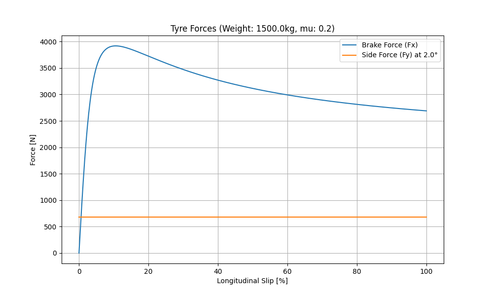

# VCVD_2025_Merbouni_s2510787024

#  Tyre Modeling Using Magic Formula from (Bakker et al., 1987) Research Paper

## Description
This project implements the `Magic Formula` tyre model for calculating longitudinal brake force ($F_x$) and lateral side force ($F_y$). It uses the mathematical models provided in the 1987 SAE paper: *`Tyre Modelling for Use in Vehicle Dynamics Studies`* by Bakker, Nyborg, and Pacejka.

## Features
- **Data Loading:** Imports coefficients from `Tyre_coefficients.xlsx` using Pandas.
- **Dynamic Calculation:** Uses `argparse` to accept real-time inputs for slip angle, vehicle weight, and friction coefficient.
- **Visualization:** Generates and saves a Matplotlib plot showing the relationship between slip and tyre forces.

## Requirements
To run this project, you need Python installed along with:
- `pandas`, `numpy`, `matplotlib`, `scipy`, `openpyxl`

## Installation & Usage
Run the script from your terminal using this format:

python s2510787024.py slip_angle_degrees weight_kg friction_mu

## Execution Example
`plot_2.0_1500.0_0.2.png`

